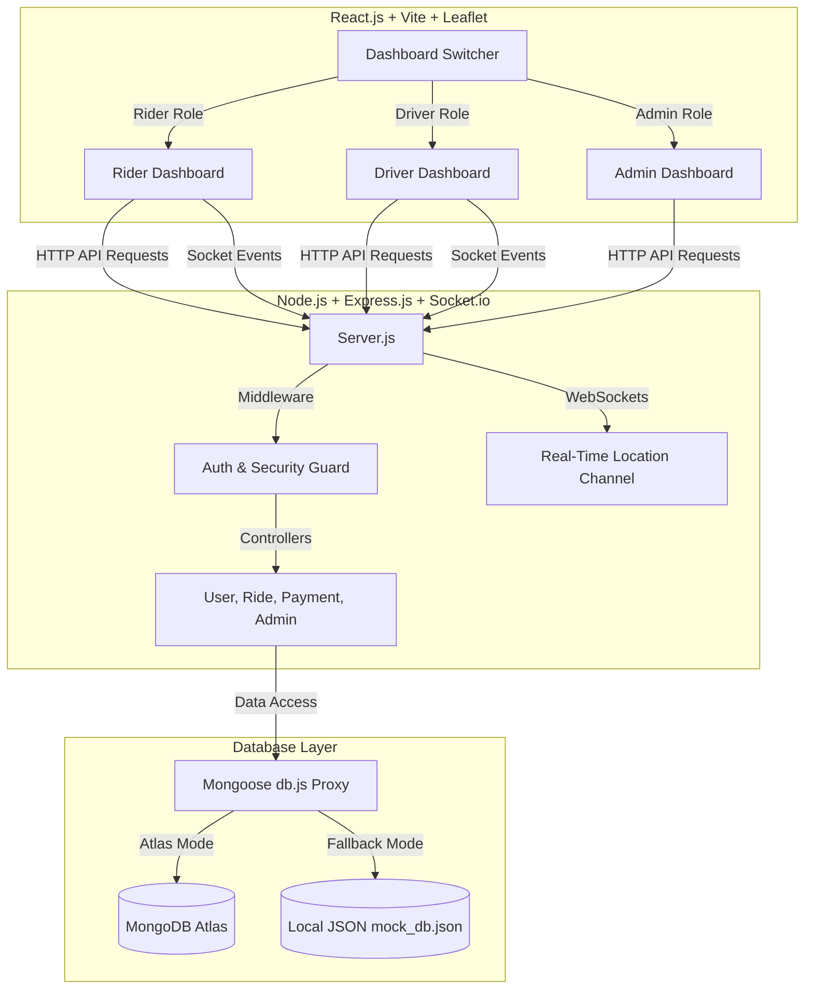

# Ucab 🚖 Next-Gen MERN Stack Cab Booking System

Ucab is a premium, secure, and reliable cab booking application built on the **MERN Stack** (MongoDB, Express.js, React, Node.js). Designed for a seamless ride-hailing experience, Ucab features interactive mapping (Leaflet.js), real-time updates via Socket.io, role-based dashboards, secure payments, and a modern dark glassmorphism user interface.

---

## 🏗️ Project Architecture



---

## ✨ Features

### 👤 Rider Portal
- **Interactive Routing**: Tap and drop pins on a customized Leaflet dark map to select pickup and dropoff points, or search addresses in India.
- **Fare Estimate & Comparison**: View real-time estimated fare across multiple vehicle classes (Moto Bike, Standard Sedan, Premium SUV) with dynamic ETAs.
- **Eco-Donations**: Add optional contributions (₹10, ₹20, ₹50) to the Green Earth Foundation.
- **Promo System**: Save up to ₹50 or get 20% off by applying promotional discount codes (e.g. `WELCOME5`, `UCAB20`).
- **In-Ride Refreshment Bar**: Purchase drinks (water, soda) or snacks directly from the dashboard while your ride is in progress. The fare updates instantly.
- **Saved Cards Checkout**: Add and delete cards securely to experience automatic fare deduction upon ride completion.

### 🚘 Driver Portal
- **Online/Offline Switcher**: Control availability status at any time.
- **Ride Request Queue**: Receive incoming requests in real-time, with detailed routes, fares, and options to accept or reject them.
- **Active Trip Manager**: Step-by-step progress tracking: Accept → Reached Pickup → Start Trip → Complete Trip.
- **GPS Simulation & Sharing**: Update and broadcast real-time location via Socket.io. If GPS is unavailable, use the clearly labelled **"Simulate Driver Movement"** button to mock progress for demo purposes.
- **Verification Status**: Displays a verification alert if the admin has not yet approved the driver's license.

### 🛡️ Admin Dashboard
- **Aggregate Analytics**: Instant statistics for total rides, completed bookings, cancellations, online drivers, registered users, and system earnings.
- **User Directory**: Search and audit all riders and administrators in the system.
- **Driver Verification Desk**: Review driver registrations, vehicles, licenses, and toggle verification approval statuses instantly.
- **Rides Audit Ledger**: Comprehensive view of all requested, cancelled, and active rides.
- **Payment Ledger**: Real-time auditing of completed transaction IDs, amounts, and settlement methods.

### 🔒 Security Implementations
- **HTTP Security Headers**: Powered by `helmet` to protect the API from header exploits.
- **API Rate Limiting**: Built-in request limiting per IP on core routes, with stricter rules on authorization routes (`/login`, `/register`).
- **Data Sanitization**: Prevents injection attacks and enforces strict schema fields.
- **Input Validation**: Uses `express-validator` to scrub and check payload formats before controller execution.
- **Session Tokens**: Clean JWT authentication expiring in 7 days, with zero hardcoded secret fallbacks.

---

## 🛠️ Tech Stack

- **Frontend**: React (Vite), Leaflet Map, CSS3 (Glassmorphism design system), Bootstrap 5, Socket.io-client, Axios.
- **Backend**: Node.js, Express.js, Socket.io, Mongoose (MongoDB).
- **Security**: Helmet, Express Rate Limit, Express Validator, Bcryptjs, Jsonwebtoken.

---

## 📂 Folder Structure

```text
cabooking/
├── backend/
│   ├── config/db.js          # Dual-mode database fallback compiler
│   ├── controllers/          # Business logic handlers (Auth, Rides, Payments, Admin)
│   ├── middleware/           # Auth JWT validations, role checkers, error managers
│   ├── models/               # Schemas (User, Ride, Payment)
│   ├── routes/               # Express endpoints router maps
│   ├── mock_db.json          # File database fallback database (auto-seeded)
│   ├── server.js             # Main server startup & socket connection managers
│   ├── .env.example          # Backend configuration keys template
│   └── package.json          # Backend project dependencies
├── frontend/
│   ├── public/               # Public assets
│   ├── src/
│   │   ├── components/       # Custom Navbar & Leaflet MapContainer
│   │   ├── context/          # React AuthContext, Axios client & Sockets
│   │   ├── pages/            # View dashboards (Home, Login, Register, Dashboards)
│   │   ├── App.jsx           # App routes and dashboard router
│   │   ├── index.css         # Styling system (glassmorphism & glowing highlights)
│   │   └── main.jsx          # DOM mounting
│   ├── index.html            # Main document loader
│   ├── .env.example          # Frontend configuration keys template
│   ├── vite.config.js        # Vite bundler configuration
│   └── package.json          # Frontend project dependencies
├── postman/
│   └── Ucab_API_Collection.json # Importable Postman collection
├── screenshots/              # Folder containing screenshots demonstrating UI flows
├── DEPLOYMENT_GUIDE.md       # Step-by-step instructions for hosting
├── API_DOCUMENTATION.md      # Detailed API endpoint references
├── REVIEW_REPORT.md          # Internal SmartBridge scorecard evaluation
├── CHANGELOG.md              # Versions history tracking
├── render.yaml               # Infrastructure configuration for Render
└── README.md                 # Primary system manual
```

---

## 🚀 Installation & Local Setup

### 1. Backend Setup
1. Open a terminal and navigate to the backend directory:
   ```bash
   cd backend
   ```
2. Install the backend dependencies:
   ```bash
   npm install
   ```
3. Create your `.env` file from the template:
   ```bash
   copy .env.example .env
   ```
4. Configure your database URI and JWT secret inside `.env`.
5. Start the backend server:
   ```bash
   npm run dev
   ```
   *The backend will run on `http://localhost:5000`*

### 2. Frontend Setup
1. Open another terminal and navigate to the frontend directory:
   ```bash
   cd frontend
   ```
2. Install the frontend dependencies:
   ```bash
   npm install
   ```
3. Create your `.env` file from the template:
   ```bash
   copy .env.example .env
   ```
4. Start the development server:
   ```bash
   npm run dev
   ```
   *The frontend will run on `http://localhost:5173`*

---

## 🔑 Demo & Test Accounts

You can log in instantly using the pre-seeded credentials available on the login screen:

| Role | Email | Password | Pre-loaded Details |
| :--- | :--- | :--- | :--- |
| **Rider (User)** | `rider@ucab.com` | `rider123` | Pre-saved Visa 4242 & Mastercard 8888 cards |
| **Driver** | `driver@ucab.com` | `driver123` | Verified status, sedan vehicle assigned |
| **Admin** | `admin@ucab.com` | `admin123` | Platform Administrator access |

---

## 💻 Screenshots Section

The screenshots showing the interactive Rider Panel, dynamic Driver Dashboard with simulation controls, and the statistical Admin Dashboard are located in the [screenshots](file:///c:/Users/LENOVO/OneDrive/Desktop/cabooking/screenshots) directory.

---

## 📡 Core API Endpoints

A quick overview of key endpoints. See [API_DOCUMENTATION.md](file:///c:/Users/LENOVO/OneDrive/Desktop/cabooking/API_DOCUMENTATION.md) for full descriptions.

- **Authentication**:
  - `POST /api/auth/register` - Create account (User or Driver)
  - `POST /api/auth/login` - Retrieve JWT session token
  - `GET /api/auth/me` - Retrieve authenticated session profile
- **Rider Rides**:
  - `GET /api/rides/estimate` - Calculate distance, duration, and fare estimates
  - `POST /api/rides/book` - Request a cab and assign a driver
  - `POST /api/rides/buy-refreshment` - Purchase refreshments during a ride
- **Driver Rides**:
  - `GET /api/rides/driver/rides` - Get assigned requests
  - `PUT /api/rides/driver/accept/:rideId` - Driver accepts booking request
  - `PUT /api/rides/driver/status` - Advance trip stages (pickup, inprogress, completed)
- **Admin**:
  - `GET /api/admin/stats` - Fetch aggregate metrics
  - `PUT /api/admin/drivers/:driverId/verify` - Toggle driver verified status

---

## ☁️ Deployment

For deployment details, check [DEPLOYMENT_GUIDE.md](file:///c:/Users/LENOVO/OneDrive/Desktop/cabooking/DEPLOYMENT_GUIDE.md).
- **Backend API & WebSockets**: Hosted on Render
- **Frontend Assets**: Hosted on Render or Vercel

---

## ⚠️ Known Limitations

- **Map Pins**: Nominatim address search results are limited to locations inside India by default (configured for `countrycodes=in` to align with the Bangalore demo).
- **Payment Gateway**: Simulated payment capture only. No real banking operations are initiated.

---

## 🚀 Future Enhancements

- **Real Payment Processing**: Integration with Razorpay or Stripe.
- **Route Optimization**: Integrating the Leaflet Routing Machine for optimal street-by-street path matching instead of straight-line coordinates.
- **Push Notifications**: Integrating web push capabilities for offline drivers and riders.

---

## 📄 License

This project is licensed under the MIT License - see the LICENSE file for details.
